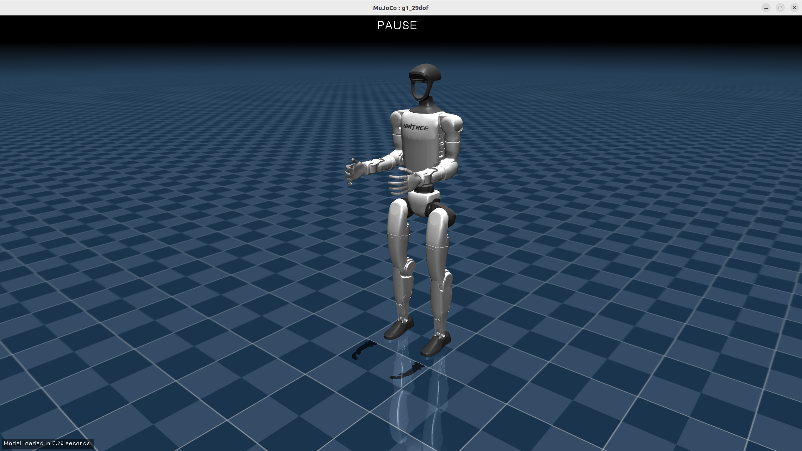

# Unitree G1 Robot Simulation Project



A comprehensive simulation environment for the Unitree G1 humanoid robot using MuJoCo physics engine, Docker containerization, and a few motion control capabilities.

## 🚀 Features

- **Physics Simulation**: High-fidelity MuJoCo physics simulation with 29 DOF G1 robot model with D435i camera streaming
- **Docker Environment**: Containerized development with GUI support and X11 forwarding
- **Motion Control**: Basic motion control using joint position control
- **Multiple Behaviors**: Pre-programmed behaviors including waving, pointing, and grasping
- **Camera Integration**: Added a camera to g1 xml and modified unitree_mujoco and unitree_sdk2py_bridge for Real-time camera data streaming and object localization
- **SDK Integration**: Full Unitree SDK2 Python integration for real robot communication
- **Interactive Control**: Menu-driven interface for motion selection and execution

## 🎥 Video Demo
[


## 📋 Prerequisites

### System Requirements
- **Docker**: Docker and Docker Compose installed
- **Graphics**: X11 display server
- **Hardware**: Minimum 8GB RAM

### Software Dependencies
- Docker Engine 20.10+
- Docker Compose 2.0+
- X11 display server (typically pre-installed on Linux desktop)

## 🐳 Docker Container Setup

### 1. Navigate to Project Directory
```bash
cd /path-to-project-folder/g1
```

### 2. Build and Launch Container

#### Option A: Build and Run (Recommended for first time)
```bash
# Navigate to docker directory
cd docker

# Allow X11 forwarding for GUI applications
xhost +local:docker

# Build and start the container
docker-compose up --build
```

#### Option B: Run Pre-built Container
```bash
cd docker
xhost +local:docker
docker-compose up
```

#### Option C: Run in Background (Detached Mode)
```bash
cd docker
xhost +local:docker
docker-compose up -d
```

### 3. Access Container Terminal
Once the container is running, open a new terminal and access the container:

```bash
# From project root directory
cd docker
docker-compose exec unitree_mujoco_sim bash
```

You can open multiple terminal sessions by running this command in different terminal windows.

### 4. Stop Container (Finally After Launching simulation)
```bash
# Stop the container (from docker directory)
docker-compose down

# Optionally revoke X11 access
xhost -local:docker
```

## 🎮 Launching the Simulation

### Start MuJoCo Simulation
In the container terminal:

```bash
# Navigate to simulation directory
cd /root/simulate

# Launch the MuJoCo simulation with g1 robot
python3 unitree_mujoco.py
```
### Developed Simulation Features
- **Camera Placement and Streaming**: Added D435i camera to robot model and setup rgb and depth streaming for access to object localization application. Modified uintree_mujoco.py and unitree_sdk2py_bride.py to achieve this.

## 🤖 Running Applications

### 1. Basic Motion Control

```bash
cd /root/src/motion_control
python3 robot_control.py
```

**Features:**
- Interactive menu system
- Choose between waving, pointing, and grasping
- Select left or right hand
- Multiple pointing directions (forward, left, right, up)
- Detailed progress feedback

### 2. Camera and Vision Applications
```bash
cd /root/src/camera
python3 object_localization.py
```
- Real-time object detection and localization based on color (currently detecting red objects using opencv)
- Camera feed processing
- Integration with motion control for object interaction

### 3. Both the applications can run in parallel as well

## 📁 Project Structure

```
g1/
├── docker/                          # Docker configuration
│   ├── docker-compose.yml          # Container orchestration
│   └── Dockerfile.unitree_mujoco   # Container image definition
│
├── simulate/                        # Simulation core
│   ├── config.py                   # Simulation configuration
│   ├── unitree_mujoco.py          # Main simulation entry point
│   └── unitree_sdk2py_bridge.py   # SDK bridge for communication
│
├── src/                            # Application source code
│   ├── camera/                     # Vision and camera applications
│   │   └── object_localization.py
│   └── motion_control/             # Motion control applications
│       ├── robot_control.py       # Universal motion center
│       ├── wave.py                # Waving motion demo
│       ├── grasp.py               # Grasping motion demo
│       └── point.py               # Pointing motion demo
│
└── unitree_robots/                 # Robot models and assets
    └── g1/                        # G1 robot specific files
        ├── g1_29dof_cam.xml       # Robot model with cameras
        ├── scene_29dof_cam.xml    # Complete scene definition
        ├── images/                # Reference images
        └── meshes/                # 3D mesh files
```

## ⚙️ Configuration

### Simulation Configuration (`simulate/config.py`)
```python
ROBOT = "g1"                    # Robot type
DOMAIN_ID = 1                   # Network domain ID
INTERFACE = "lo"                # Network interface
USE_JOYSTICK = 0               # Gamepad support
SIMULATE_DT = 0.005            # Simulation timestep
VIEWER_DT = 0.02               # Viewer refresh rate
ENABLE_ELASTIC_BAND = True     # Virtual spring tool
```

## 🔧 Troubleshooting

### Docker Issues

**Container won't start:**
```bash
# Check Docker status
sudo systemctl status docker

# Restart Docker service
sudo systemctl restart docker

# Rebuild container
docker-compose build --no-cache
```

**GUI not displaying:**
```bash
# Ensure X11 forwarding is enabled
xhost +local:docker

# Check DISPLAY environment variable
echo $DISPLAY

# Test X11 connection
xeyes  # Should open a test window
```

**Permission issues:**
```bash
# Fix X11 permissions
xhost +local:docker
sudo chmod 666 /tmp/.X11-unix/*
```

## 🚀 Quick Start Guide

1. **Setup Environment:**
   ```bash
   cd /path/to/g1/docker
   xhost +local:docker
   docker-compose up --build
   ```

2. **Open Container Terminal:**
   ```bash
   docker-compose exec unitree_mujoco_sim bash
   ```

3. **Start Simulation:**
   ```bash
   cd /root/simulate
   python3 unitree_mujoco.py
   ```

4. **Run Motion Control (in new terminal):**
   ```bash
   docker-compose exec unitree_mujoco_sim bash
   cd /root/src/motion_control
   python3 robot_control.py
   ```

5. **Follow Menu Prompts:**
   - Choose motion type
   - Select hand
   - Execute and observe!

6. **Run Object Detection (in new terminal):**
   ```bash
   docker-compose exec unitree_mujoco_sim bash
   cd /root/src/camera
   python3 object_localization.py
   ```

## 📚 Additional Resources

- **Unitree SDK Documentation**: [Official Unitree SDK2 Python Guide](https://github.com/unitreerobotics/unitree_sdk2_python)
- **MuJoCo Documentation**: [MuJoCo Physics Engine](https://mujoco.readthedocs.io/)
- **Docker Documentation**: [Docker Compose Guide](https://docs.docker.com/compose/)

## 🤝 Acknowledgements

AI Assistant claude-4-sonet for improving the quality of the code and documentation

---

**Happy Robotics Development! 🤖✨**
